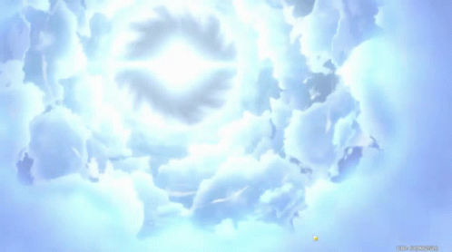

<h1>GenshinWishSimulator</h1>

>Status: Completo

Este é um projeto pensado e desenvolvido por mim, feito com o intúito de ser um simulador para os usuários fazerem "desejos", igual ao jogo Genshin impact.

### Funcionalidades

- [x] Realizar desejos x1
- [x] Realizar desejos x10
- [x] Pular animação de desejo

<h2>Como o GenshinWishSimulator funciona?</h2>

No GenshinWishSimulator você pode realizar desejos no estilo "Gacha", popular nos jogos atuais. Nos desejos o usuário poderia ganhar personagens e armas com 3 tipos de raridades diferentes, sendo elas: 3 estrelas ⭐⭐⭐, 4 estrelas ⭐⭐⭐⭐ ou se você for uma pessoa muito sortuda, 5 estrelas ⭐⭐⭐⭐⭐.

  
 <h2>Como realizo os desejos?</h2>

 Para realizar desejos basta você clicar em quantos desejos você quer realizar, x1 ou x10, clicando na quantidade desejada uma animação do desejo vai começar, de acordo com a animação o usuário vai poder descobrir qual raridade de item ele irá ganhar baseado na cor do cometa.

<h3> Animação de item 3 estrelas ⭐⭐⭐<h3>

<h3> Animação de item 4 estrelas ⭐⭐⭐⭐<h3>
  

  
<h3> Animação de item 5 estrelas ⭐⭐⭐⭐⭐<h3>

  <h2>As seguintes tecnologias foram utilizadas nesse projeto</h2>
  
  - Javascript
  - Html
  - Css
  
